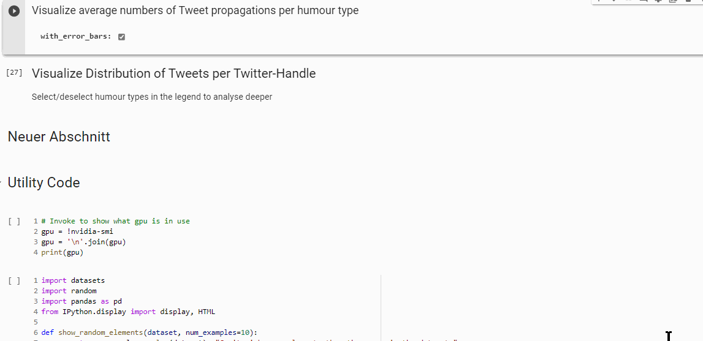

# humour-detection

## MSc Thesis Project UvA 2021<br>
Author: Janice Butler<br>University of Amsterdam, 2021<br><br>
A project to fine-tune neural language models (NLMs) for tasks involving the detection and measurement of humour-type and the degree of humour in a text. Much emphasis is placed on determining which NLM is optimal for this task and which hyperparameters are most efficient, but also most accurate in inference of the tasks.<br>

## Getting Started

The project is organised in 3 phases

1. Data capture: Data is scraped from both Reddit.com and Twitter.com. <br>The code for scraping is to be found in https://github.com/jb-diplom/humour-detection/tree/main/scraping
2. The scraped data is processed and annotated for use in fine-tuning of the NLMs. Intermediate raw data is saved in https://github.com/jb-diplom/humour-detection/tree/main/data-training and the final processed, randomly shuffled and segmented data is saved in https://github.com/jb-diplom/humour-detection/tree/main/data-training/complete. 3 Tasks are being trained for:
   * 5 degrees of humour plus the non-humorous category (k=6)
   * 2 degrees of humour (binary humour-recognition)  (k=2)
   * 9 types of humour: fun, benevolent humour, nonsense, wit, irony, satire, sarcasm, and cynicism k=9)
3. Once the data is annotated, shuffled and segmented it can be used to fine-tune the NLMs using the [Colab-Notebook] (https://github.com/jb-diplom/humour-detection/blob/main/notebooks/NLM_Trainer.ipynb)

### Prerequisites

To run the notebook there are no prerequesites except access to [Google Colab](https://colab.research.google.com/notebooks/intro.ipynb?utm_source=scs-index), since all the required libraries are installed in the first code-cell of the notebook:

The principal components used are 
* transformers              # huggingface framework for loading and training models, preprocessing of data
* wandb                     # for visualization of results on the project dashboard https://wandb.ai/jb-diplom/janice-final
* sentencepiece             # required for fine-tuning the deberta NLM
* chart_studio              # for visulization using Plotly Express
* google.colab.data_table   * A widget very useful for browsing dataframes and compatible with colab

## Usage

pull this repository from Github

### Scraping reddit data
```
cd to ... <MYREPOSITORY>\humour-detection\scraping\reddit\prepare_data
python gather_reddit_pushshift.py after cd prepare_data to gather the Reddit post ids.
python preprocess.py --update to update the Reddit post IDs with the full post.
python preprocess.py --preprocess to preprocess the Reddit posts into final datasets

# Using different subdirs...
python preprocess.py --update --subdir_name datasarcasm --file_name_update submissions1559920049.json --output_name_update fulldatasarcasm.json
python preprocess.py --preprocess --subdir_name datasarcasm --file_name_preprocess fulldatasarcasm.json 
```

### Scraping Twitter Data
Open [scraping\twitter\snscrape-gb_mps.ipynb ](https://github.com/jb-diplom/humour-detection/blob/main/scraping/twitter/snscrape-gb_mps.ipynb) in your favourite IDE
Note that in the same directory there are lists of twitter handles in text files:
* journalists.txt
* mps.txt
* comedians.txt
* serious_news.txt

These are the twitter handles targeted for this political humour project, but you can add your own handles.
Sorry, but this next bit is very rudimentary.
* Invoke the first 4 cells
* The next cell is set up for scraping (a maximum of ) 250000 tweets from uk MPs (hence the filename set to mps.txt). Set values of 
```
maxTweets = 25          # set as required
file_name = "mps.txt"   # set as required (e.g. to "journalists.txt", "serious_news.txt" or "comedians.txt")
```
* Invoke the next cell and create a dtaframe of the scraped data (we only keep the columns=['tweetId', 'content', 'username','followers', 'conversationId', 'replyCount', 'retweetCount', 'likeCount', 'quoteCount'])
* Save the data  with Tab separation and named as you wish, ready for humour analysis and correlatiion using the cell with thios line
```
tweets_df1.to_csv('comedian-tweets250.csv', sep='\t', index=False, encoding="utf-16")
```

There are various utility functions further down in this notebook, for instance for saving purely serious data (without meta-data) with the annotation '0' indication humour-type 0 (i.e. serious)

# Fine-Tuning 
The fine-tuning takes placeusing the [Colab-Notebook] (https://github.com/jb-diplom/humour-detection/blob/main/notebooks/NLM_Trainer.ipynb). Here ar the steos needed:

## Installation and Imports

## Connect to WandB, Mount GDrive


## Specifying Model-Type and Fine-Tuning Parameters


## Choose Training Data


## Do Fine-Tuning


## Test The Model
Here the model is loaded from the W&B database, the amount of data to be used for testing is chosen (here 1000 records), the model is tested with the data and the resultant statistics (ROC, precision and recall) are calculated and visualized in a confusion matrix.<br>
Finally the precision coefficients (F1 and Matthew's) are calculated and the results written back to W&B<br>


# Correlate with Twitter data
## Load Twitter Data
Begin by loading the scraped twitter data


## Filter According to Number of Likes (optionally)


## Visualize in Facetted Scatter Plot


## Calculate Statistics


## Viszalize Propagation Statistics


## Viszalize User Statistics


# Versioning

All code is versioned in Github in [this repository](https://github.com/jb-diplom/humour-detection). 

## Authors

* **Janice Butler** - *Initial work* - [Humour-Detection](https://github.com/jb-diplom/humour-detection)

## License

This project is licensed under the MIT License - see the [LICENSE.md](./LICENSE.md) file for details

## Acknowledgments

* Many thanks to my thesis supervisor [Dr. Damian Trilling](https://www.uva.nl/en/profile/t/r/d.c.trilling/d.c.trilling.html) for basically letting me get on with it but providing advice and guidance as needed
